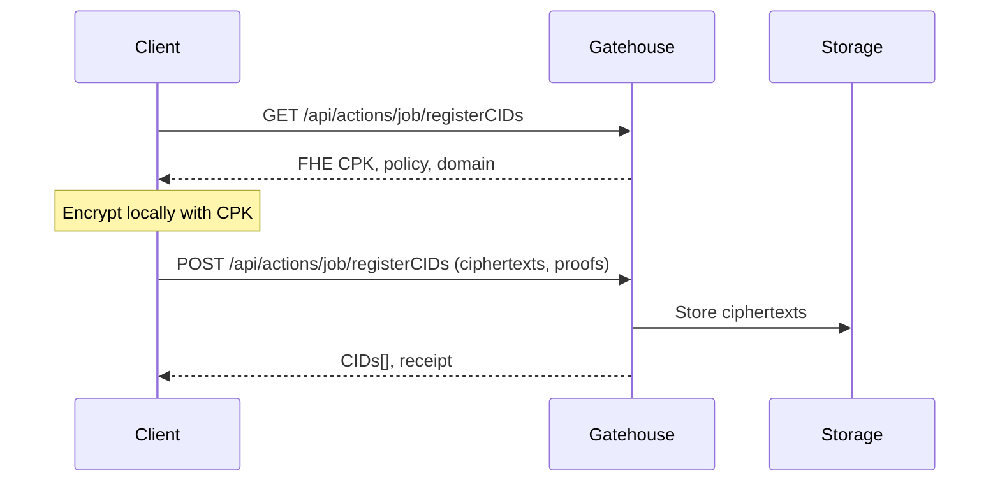
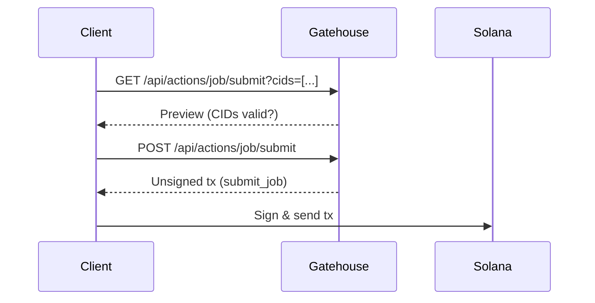
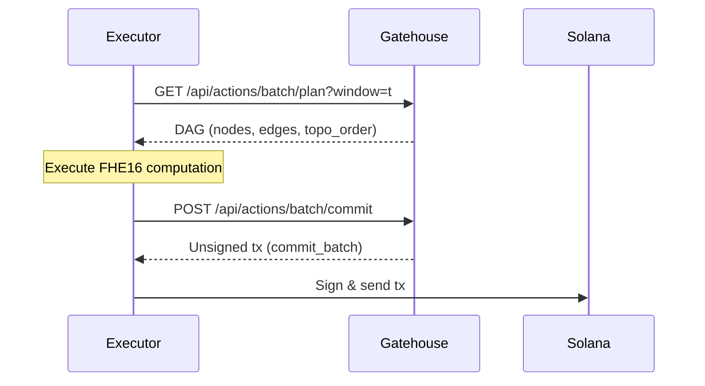
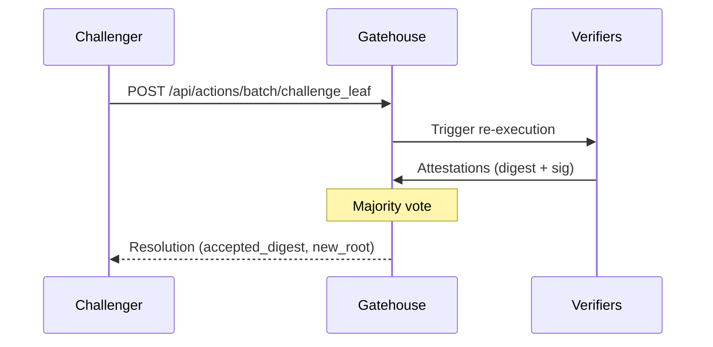
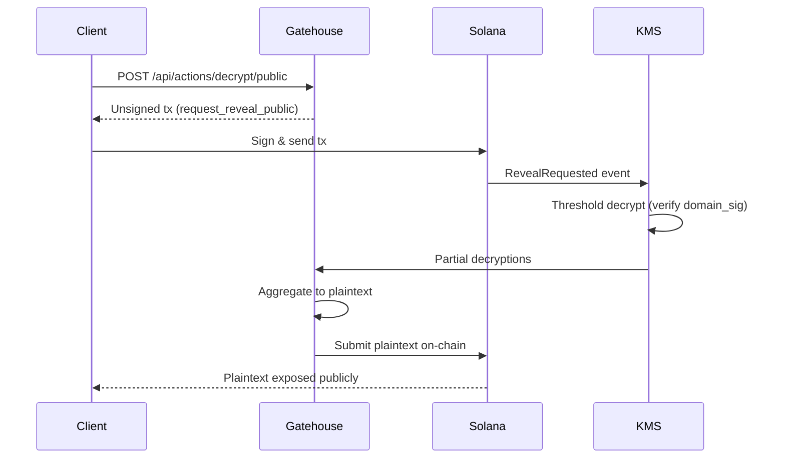
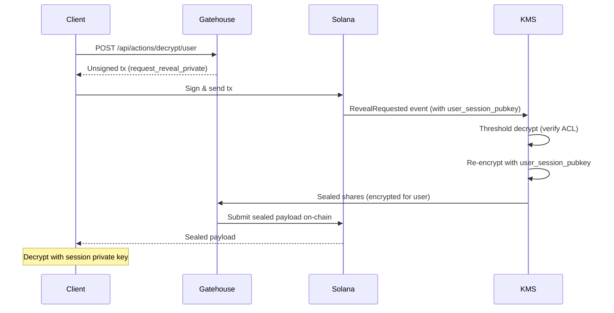

# Lattica Gatehouse

**FHE-based Confidential Computation on Solana**

Lattica Gatehouse is the Actions API server for orchestrating confidential computation workflows using Fully Homomorphic Encryption (FHE) on Solana blockchain.

---

## 🚀 Quick Start

### Installation

```bash
npm install
```

### Start Development Server

```bash
npm run dev
# Server runs on http://localhost:3000
```

### Run Integration Tests

```bash
# Test all 5 phases with validation (API only)
./test-all-phases.sh

# Test real workflow with EventListener & JobQueue
./test-real-workflow.sh
```

---

## 🏗️ Architecture Overview

### Technology Stack

- **Next.js 15** - React framework with App Router
- **Gill 0.11.0** - Solana SDK
- **Anchor** - Solana program framework
- **Wallet UI** - Solana wallet components
- **Tailwind + Shadcn** - UI styling

### Project Components

- **Gatekeeper Program** (Solana): On-chain verification and state management
- **Gatehouse (this)**: Actions API server for workflow orchestration
- **KMS**: Threshold decryption (t-of-n distributed key management)
- **Executors**: Offchain FHE16 computation nodes
- **Offchain Storage**: ciphertext storage

---

## 🎯 Demo Workflow with Phantom Wallet

### End-to-End Test Scenario

**Goal**: Test the complete workflow from Job submission to DAG-based execution planning.

1. **Start Server**
   ```bash
   npm run dev
   # EventListener starts automatically via instrumentation.ts
   ```

2. **Register CIDs** (using dial.to + Phantom)
   ```
   https://dial.to/?action=solana-action:http://localhost:3000/api/actions/job/registerCIDs
   ```

3. **Submit Job** (using dial.to + Phantom)
   ```
   https://dial.to/?action=solana-action:http://localhost:3000/api/actions/job/submit
   ```

4. **Monitor EventListener** (automatic)
   - EventListener catches `JobSubmitted` event
   - Job moves from pending → JobQueue (queued)
   - Check logs for: `[EventListener] Job enqueued for execution`

5. **Query DAG Plan** (real JobQueue data)
   ```bash
   curl http://localhost:3000/api/actions/batch/plan | jq
   ```

**See detailed guide**: [DEMO_WORKFLOW.md](./DEMO_WORKFLOW.md)

---

## 🔄 Complete Workflow (5 Phases)

### Phase 1: Encryption & Registration

**Client → Gatehouse → Offchain Storage**



**Endpoints:**
- `GET /api/actions/job/registerCIDs` - Get FHE CPK
- `POST /api/actions/job/registerCIDs` - Register ciphertexts → CIDs

**Example:**
```bash
# 1. Get FHE CPK
curl http://localhost:3000/api/actions/job/registerCIDs

# 2. Register ciphertexts
curl -X POST http://localhost:3000/api/actions/job/registerCIDs \
  -H "Content-Type: application/json" \
  -d '{
    "account": "YOUR_WALLET",
    "ciphertexts": [{"encrypted_data": "ct1"}],
    "enc_params": {"scheme": "FHE16"},
    "policy_ctx": {"version": "1.0"}
  }'
```

---

### Phase 2: Job Submission

**Client → Gatehouse → Gatekeeper (Solana)**



**Endpoints:**
- `GET /api/actions/job/submit` - Preview job submission
- `POST /api/actions/job/submit` - Create submit_job transaction

**Commitment Formula:**
```
cid_set_id = sha256(cid_pda_1 || cid_pda_2 || ...)
commitment = sha256(cid_set_id || ir_digest || policy_hash || domain_hash || nonce)
```

**Example:**
```bash
curl -X POST http://localhost:3000/api/actions/job/submit \
  -H "Content-Type: application/json" \
  -d '{
    "account": "YOUR_WALLET",
    "cids": ["CID1", "CID2"],
    "batch": "BATCH_PUBKEY",
    "ir_digest": "0x1234...abcd",
    "policy_ctx": {"version": "1.0"}
  }'
```

---

### Phase 3: Batch Execution (Optimistic)

**Executors → Gatehouse → Gatekeeper**



**Endpoints:**
- `GET /api/actions/batch/plan` - Get DAG execution plan
- `POST /api/actions/batch/commit` - Commit batch results (optimistic)

**Key Features:**
- Topological sort with decrypt-needed prioritization
- Merkle tree for batch results
- Challenge window (configurable slots)

**Example:**
```bash
# Get execution plan
curl "http://localhost:3000/api/actions/batch/plan?window=1000"

# Commit batch
curl -X POST http://localhost:3000/api/actions/batch/commit \
  -H "Content-Type: application/json" \
  -d '{
    "account": "YOUR_WALLET",
    "window_start_slot": 1000,
    "commit_root": "0xabcd...1234",
    "result_commitment": "0x5678...ef90",
    "processed_until_slot": 1050
  }'
```

---

### Phase 4: Challenge & Verification

**Challenger → Verifiers → Gatekeeper**



**Endpoints:**
- `GET /api/actions/batch/challenge_leaf` - Check challenge status
- `POST /api/actions/batch/challenge_leaf` - Open challenge on specific leaf

**Example:**
```bash
curl -X POST http://localhost:3000/api/actions/batch/challenge_leaf \
  -H "Content-Type: application/json" \
  -d '{
    "commit_id": "BATCH_PDA",
    "leaf_idx": 0,
    "d_conflict": "0xdead...beef",
    "merkle_proof": ["0xproof1...", "0xproof2..."]
  }'
```

---

### Phase 5a: Public Decryption

**Client → Gatehouse → KMS → Client**



**Endpoints:**
- `GET /api/actions/decrypt/public` - Public decrypt info
- `POST /api/actions/decrypt/public` - Request public decryption (with domain signature)

**Example:**
```bash
curl -X POST http://localhost:3000/api/actions/decrypt/public \
  -H "Content-Type: application/json" \
  -d '{
    "account": "YOUR_WALLET",
    "handle": "0xaabb...ccdd",
    "domain_signature": "0x5566...7788"
  }'
```

---

### Phase 5b: User Decryption

**Client → Gatehouse → KMS → Client**



**Endpoints:**
- `GET /api/actions/decrypt/user` - User decrypt info
- `POST /api/actions/decrypt/user` - Request user decryption (ACL-based)

**Example:**
```bash
curl -X POST http://localhost:3000/api/actions/decrypt/user \
  -H "Content-Type: application/json" \
  -d '{
    "account": "YOUR_WALLET",
    "handle": "0xbbcc...ddaa",
    "user_session_pubkey": "0x5566...7788",
    "purpose_ctx": "user-view"
  }'
```

---

## 📋 API Reference

### Complete Endpoint List

| Phase | Method | Endpoint | Description |
|-------|--------|----------|-------------|
| 1 | GET | `/api/actions/job/registerCIDs` | Get FHE CPK info |
| 1 | POST | `/api/actions/job/registerCIDs` | Register ciphertexts |
| 2 | GET | `/api/actions/job/submit` | Preview job |
| 2 | POST | `/api/actions/job/submit` | Submit job |
| 3 | GET | `/api/actions/batch/plan` | Get DAG plan |
| 3 | GET | `/api/actions/batch/commit` | Get commit info |
| 3 | POST | `/api/actions/batch/commit` | Commit batch |
| 4 | GET | `/api/actions/batch/challenge_leaf` | Check challenge |
| 4 | POST | `/api/actions/batch/challenge_leaf` | Open challenge |
| 5a | GET | `/api/actions/decrypt/public` | Public decrypt info |
| 5a | POST | `/api/actions/decrypt/public` | Request public decrypt |
| 5b | GET | `/api/actions/decrypt/user` | User decrypt info |
| 5b | POST | `/api/actions/decrypt/user` | Request user decrypt |

### Common Headers

All endpoints include CORS headers:
```
Access-Control-Allow-Origin: *
Access-Control-Allow-Methods: GET,POST,PUT,OPTIONS
Access-Control-Allow-Headers: Content-Type, Authorization, Content-Encoding, Accept-Encoding
```

### Solana Actions Routing

Configured in `public/actions.json`:
```json
{
  "rules": [
    { "pathPattern": "/actions/job/registerCIDs", "apiPath": "/api/actions/job/registerCIDs" },
    { "pathPattern": "/actions/job/submit", "apiPath": "/api/actions/job/submit" },
    { "pathPattern": "/actions/batch/plan", "apiPath": "/api/actions/batch/plan" },
    { "pathPattern": "/actions/batch/commit", "apiPath": "/api/actions/batch/commit" },
    { "pathPattern": "/actions/batch/challenge_leaf", "apiPath": "/api/actions/batch/challenge_leaf" },
    { "pathPattern": "/actions/decrypt/public", "apiPath": "/api/actions/decrypt/public" },
    { "pathPattern": "/actions/decrypt/user", "apiPath": "/api/actions/decrypt/user" }
  ]
}
```

---

## 🧪 Testing Guide

### Integration Test Script

The `test-all-phases.sh` script provides comprehensive testing of all 13 API endpoints:

```bash
./test-all-phases.sh
```
